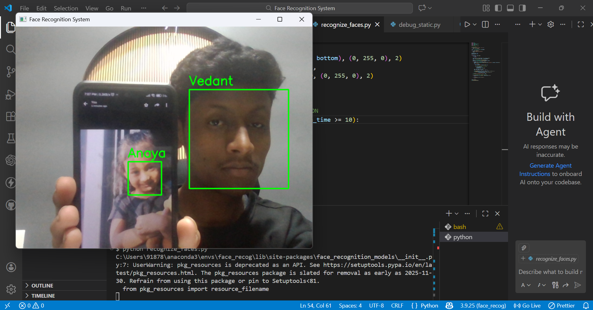

<!--  -->

**📘 Face Recognition & Face Scanning System using OpenCV & Python**

A real-time Face Recognition and Face Scanning System built using Python, OpenCV, dlib, and face_recognition.
The system detects and recognizes multiple faces from a live webcam feed, logs the first successful scan per person per day, captures a screenshot of the detected face, and automatically terminates after recognition.

This project is designed as a base system that can be extended into a full-fledged Attendance Management System in future versions.

## 🚀 Features

- Real-time face detection and recognition

- Supports multiple faces in a single frame

- Uses pre-trained deep learning face embeddings (128-D vectors)

- Face scan logging with date & time (CSV)

- Prevents repeated scans for the same person on the same day

- Automatically captures a screenshot on successful face scan

- Screenshots are saved with name, date, and time

- Unknown faces are detected but not logged or saved

- Automatically closes after successful face scan (with delay)

- Works efficiently on CPU (no GPU required)

- Modular and easy-to-extend architecture


## 🖼️ Demo Screenshot



The system scanning and recognizing Vedant and Anaya simultaneously in real time.


## 🧠 How It Works (Concept)

1️⃣ Face Detection

Faces are detected from dataset images and live webcam frames using dlib’s HOG-based face detector.

2️⃣ Face Encoding

Each detected face is converted into a 128-dimensional numerical embedding that uniquely represents facial features.

3️⃣ Face Matching

Live face embeddings are compared with stored embeddings using Euclidean distance.
If the distance is below a defined threshold, the face is recognized.

4️⃣ Face Scan Logging & Screenshot Capture

When a known face is scanned:

- Name, date, and time are logged into a CSV file

- The scan is recorded only once per person per day

- A screenshot of the webcam frame is captured and saved in PNG format

- Screenshot filename includes name, date, and time

- Re-scanning the same person on the same date does not modify the CSV

- When an unknown face is scanned:

No CSV entry is created

No screenshot is saved


## 🗂️ Project Structure

```text
Face_Recognition_System/
│
├── dataset/
│   ├── Vedant/
│   │   ├── image1.jpg
│   │   ├── image2.jpg
│   │   └── image3.jpg
│   │
│   └── Anaya/
│       ├── image1.jpg
│       └── image2.jpg
│
├── screenshots/
│   ├── output1.png
│   └── Vedant_20260210_000215.png
│
├── encode_faces.py
├── recognize_faces.py
├── debug_static.py
├── encodings.pickle
├── scanned.csv
└── README.md
```


## 🛠️ Technologies Used

- Python 3.9

- OpenCV

- dlib

- face_recognition

- NumPy

- Pillow

## ⚙️ Setup Instructions

1️⃣ Create Conda Environment

    conda create -n face_recog python=3.9

    conda activate face_recog

2️⃣ Install Dependencies

    conda install -c conda-forge dlib

    pip install face-recognition opencv-python pillow numpy

▶️ How to Run the Project

Step 1: Encode Faces

    python encode_faces.py

Step 2: Run Face Scanning System

    python recognize_faces.py

- Face scan logs are stored in scanned.csv

- Screenshots are saved in the screenshots/ folder

- Press q to exit manually

- Or the system auto-closes 5 seconds after successful scan


## 📄 Scanned Output (CSV)

Example:

Name,Date,Time

Vedant,2026-01-31,23:11:42

- Each entry represents the first successful scan of the day

- Logs are not updated on repeated scans on the same date


## 🎯 Use Cases

- Face Scanning & Identity Verification

- Entry Logging Systems

- Smart Classroom Foundations

- Access Control (base version)

- Academic & Research Projects


## ⚠️ Limitations

- Performance depends on lighting conditions

- Accuracy may reduce with occlusion (masks, caps)

- Not intended for large-scale or enterprise datasets

- Currently uses CSV instead of a database


## 🔮 Future Enhancements

- Convert face scan logs into a full Attendance Management System

- Subject-wise or session-wise attendance

- GUI using Tkinter or PyQt

- Database integration (SQLite / MySQL)

- Web-based interface using Flask

- Unknown face logging

- Emotion or mask detection


### ⭐ If you like this project

### Give it a ⭐ on GitHub — it motivates further improvements!